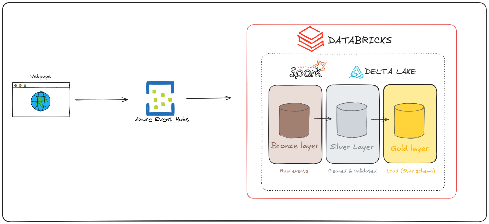

# 🍽️ Restaurant Booking Streaming Pipeline

An end-to-end streaming data pipeline simulating a restaurant booking system, built with Python, Azure Event Hubs, Databricks, and Delta Lake following the **Medallion Architecture**.

---

## 📐 Architecture



> **Luồng dữ liệu:** Flask Web App tạo booking event → gửi lên Azure Event Hubs qua Kafka protocol → Databricks dùng PySpark Structured Streaming để consume → transform qua 3 layer Bronze/Silver/Gold trong Delta Lake theo Medallion Architecture.

---

## 🗂️ Project Structure

```
├── bookingweb.py        # Flask web app — triggers booking event on button click
├── GenerateData.py      # Generates random booking data (client, table, order, time)
├── SendData.py          # Sends event to Azure Event Hubs via Kafka protocol
├── Databricks_pyspark/  # PySpark notebooks running on Databricks
│   ├── ingestion.py     # Event Hubs → Bronze table (raw stream)
│   ├── transform.py  # Bronze → Silver (parse, validate, enrich)
│   ├── dim_fact_setup.ipynb  # Seed dimension tables + create fact table schema
│   ├── dim_food_setup.py      # Create catalog, schemas
│   └── load.py  # Silver → Gold (star schema: dim/fact tables)
├── README.md
├── .gitignore
└── pyproject.toml
```

---

## 🛠️ Tech Stack

| Layer | Technology |
|---|---|
| Data Generation | Python, Flask |
| Streaming Ingestion | Azure Event Hubs (Kafka protocol) |
| Stream Processing | Apache Spark Structured Streaming (PySpark) |
| Data Storage | Delta Lake (Medallion Architecture) |
| Compute | Databricks |
| Data Modeling | Star Schema (Dim/Fact tables) |

---

## 🥇 Medallion Architecture

### Bronze — Raw Layer
Stores raw events exactly as received from Event Hubs. No transformation applied.

```
bronze.raw_bookings
├── raw_json      (raw JSON string from Kafka)
├── ingested_at   (event timestamp)
├── partition
└── offset
```

### Silver — Cleaned Layer
Parses JSON, validates data quality, and enriches with derived columns.

```
silver.bookings
├── booking_id          (UUID — unique per booking)
├── client_name
├── table_types
├── booking_time        (parsed timestamp)
├── num_of_individuals
├── is_birthdate
├── order               (MapType: food category → list of foods)
```

### Gold — Star Schema
Dimensional model optimised for analytics.

```
dim_table_type          dim_food_category       dim_food
├── table_type_id (PK)  ├── food_category_id    ├── food_id (PK)
└── table_type_name     └── food_category_name  ├── food_name
                                                 └── food_category_id (FK)

fact_booking                        fact_booking_order
├── booking_id (PK)                 ├── booking_id (FK)
├── table_type_id (FK)              ├── food_category_id (FK)
├── client_name                     ├── food_id (FK)
├── booking_time                    
├── num_of_individuals
├── is_birthdate
```

---

## 🚀 Getting Started

### Prerequisites

- Python 3.11+
- Azure account with Event Hubs namespace
- Databricks workspace (Community Edition or above)

### 1. Clone the repository

```bash
git clone https://github.com/<your-username>/restaurant-booking-pipeline.git
cd restaurant-booking-pipeline
```

### 2. Install dependencies

```bash
pip install -r requirements.txt
# or if using uv:
uv sync
```

### 3. Configure Azure Event Hubs

Create a `.env` file (never commit this):

```
EH_NAMESPACE=<your-event-hubs-namespace>
EH_NAME=<your-event-hub-name>
EH_CONN_STR=<your-connection-string>
```

### 4. Run the web app

```bash
python bookingweb.py
```

Open `http://127.0.0.1:5000`, click **Đặt bàn** to send a booking event to Event Hubs.

### 5. Run the Databricks pipeline

Upload notebooks in `Databricks_pyspark/` to your Databricks workspace and run in order:

```
00_setup.py       → Create catalog & schemas (run once)
03_dim_setup.py   → Seed dimension tables (run once)
01_ingest.py      → Start Bronze stream
02_transform.py   → Start Silver stream
04_load_gold.py   → Load Gold dim/fact tables
```

---

## 📊 Sample Analytics Queries

```sql
-- Top 10 most ordered foods
SELECT f.food_name, COUNT(*) AS total_orders
FROM gold.fact_booking_order o
JOIN gold.dim_food f ON o.food_id = f.food_id
GROUP BY f.food_name
ORDER BY total_orders DESC
LIMIT 10;

-- Bookings by hour (peak hour analysis)
SELECT booking_hour, COUNT(*) AS total_bookings, 
       AVG(num_of_individuals) AS avg_party_size
FROM gold.fact_booking
GROUP BY booking_hour
ORDER BY booking_hour;

-- Most popular food category by table type
SELECT dt.table_type_name, fc.food_category_name, COUNT(*) AS total
FROM gold.fact_booking_order fo
JOIN gold.fact_booking fb ON fo.booking_id = fb.booking_id
JOIN gold.dim_table_type dt ON fb.table_type_id = dt.table_type_id
JOIN gold.dim_food_category fc ON fo.food_category_id = fc.food_category_id
GROUP BY dt.table_type_name, fc.food_category_name
ORDER BY total DESC;
```

---

## 📝 Key Implementation Details

- **Structured Streaming** with `trigger(availableNow=True)` for Databricks Community Edition compatibility
- **Dead letter handling** — invalid events filtered to separate table for debugging
- **MERGE (upsert)** on fact tables to prevent duplicate records across pipeline runs
- **Order column exploded** from `MapType(String, Array(String))` into `fact_booking_order` for queryability
- **Separate checkpoints** per streaming job to avoid `DELTA_INVALID_SOURCE_VERSION` conflicts
